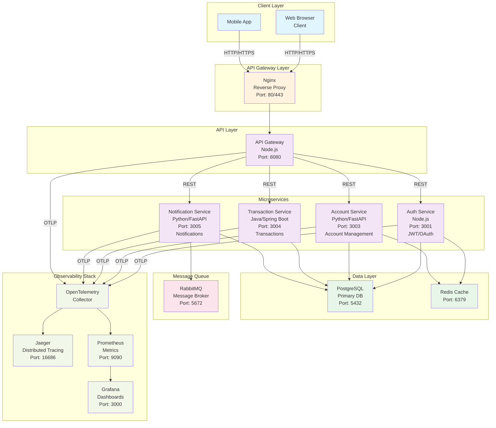

# Homebanking Microservices - Architecture Diagram

## System Architecture



## Data Flow Examples

### Authentication Flow
```
Client → Nginx → API Gateway → Auth Service → PostgreSQL
   ↓
Auth Service → JWT Token → API Gateway → Client
```

### Transaction Flow
```
Client → Nginx → API Gateway → Transaction Service → PostgreSQL
            ↓
         Account Service (verify balance)
            ↓
      Transaction Service → RabbitMQ → Notification Service
            ↓
      PostgreSQL (stores transaction) ← Notification Service
```

### Observability Flow
```
Services → OpenTelemetry SDK
    ↓
OTLP Exporter
    ↓
OpenTelemetry Collector
    ↓
┌─────────────┬─────────────┬──────────┐
↓             ↓             ↓          
Jaeger    Prometheus    Loki      Grafana (visualization)
```

## Technology Stack

| Layer | Technology | Purpose |
|-------|-----------|---------|
| **Frontend** | React/Vue | Web UI |
| **API Gateway** | Nginx | Reverse proxy, load balancing |
| **API Layer** | Node.js | Request routing |
| **Services** | Node.js, Python, Java | Business logic |
| **Database** | PostgreSQL | Primary data store |
| **Cache** | Redis | Session/cache layer |
| **Message Queue** | RabbitMQ | Async messaging |
| **Tracing** | Jaeger | Distributed tracing |
| **Metrics** | Prometheus | Metrics collection |
| **Visualization** | Grafana | Dashboard |
| **Container** | Docker | Containerization |
| **Orchestration** | Kubernetes/AKS | Container orchestration |

## Deployment Architecture (AKS)

```
Azure Subscription
├── Resource Group
│   ├── AKS Cluster
│   │   ├── Node Pool 1 (3 nodes)
│   │   └── Namespace: homebanking
│   │       ├── API Gateway Pod (2 replicas)
│   │       ├── Auth Service Pod (2 replicas)
│   │       ├── Account Service Pod (2 replicas)
│   │       ├── Transaction Service Pod (2 replicas)
│   │       ├── Notification Service Pod (2 replicas)
│   │       ├── PostgreSQL StatefulSet
│   │       ├── RabbitMQ Deployment
│   │       ├── OpenTelemetry Collector
│   │       ├── Jaeger
│   │       ├── Prometheus
│   │       └── Grafana
│   ├── Container Registry (ACR)
│   └── Load Balancer
```

## Security Architecture

```
┌─────────────────────────────────────┐
│    Azure Key Vault                  │
│  (JWT Secret, DB Credentials)       │
└────────────┬────────────────────────┘
             │
     ┌───────┴────────┐
     ▼                ▼
Network Policy    Pod Security Policy
- Ingress         - No root
- Egress          - Capabilities
                  - Read-only FS

     │
     ▼
Services (Internal)
- No external access
- Service-to-service via internal DNS
```

## High Availability Configuration

- **Replicas:** 2 per service
- **Pod Disruption Budget:** Minimum 1 pod available
- **Health Checks:** Liveness and readiness probes
- **Resource Limits:** CPU and Memory defined
- **Auto-scaling:** HPA based on CPU/Memory metrics
